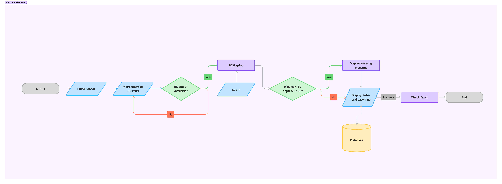
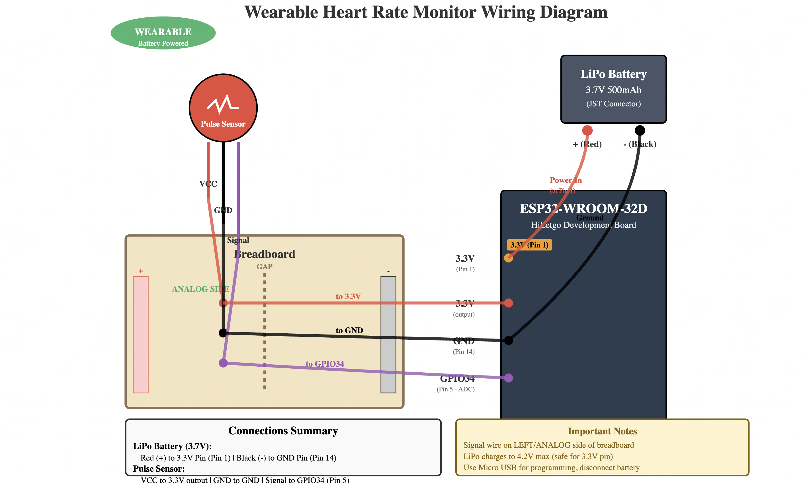

# Heart-Rate-Monitor
A wearable heart rate monitoring system built with an ESP32, pulse sensor, and LiPo battery. It reads the user’s pulse in real time and calculates BPM using Arduino code.
# 💓 Heart Rate Monitor using ESP32

A compact **wearable heart rate monitoring system** built with an **ESP32**, **pulse sensor**, and **LiPo battery**. The system measures the user’s pulse in real time, calculates **Beats Per Minute (BPM)**, and displays results via the **Arduino Serial Monitor**.

---

## ⚙️ Features
- Real-time heart rate detection using a pulse sensor  
- Accurate BPM calculation and serial output  
- Compact wearable design with wristband integration  
- Low-power operation using a 3.7V LiPo battery  
- Integrated **GitHub** and **Arduino IDE** for seamless collaboration and version control  

---

## 🧰 Components
- ESP32 Development Board  
- Pulse Sensor  
- Mini Breadboard & Jumper Wires  
- 3.7V LiPo Battery  
- Wristband  

---

## 🔌 Circuit Connections

| Pulse Sensor Pin | ESP32 Pin | Description |
|------------------|------------|--------------|
| VCC              | 3.3V / 5V  | Power supply |
| GND              | GND        | Ground |
| Signal           | GPIO 34    | Analog input |

---

## 🧩 Software Flowchart

The following flowchart illustrates the logical sequence of operations — from pulse detection to BPM calculation and display.

  
*Figure 1: Software flow of the Heart Rate Monitor program.*

---

## ⚡ Wiring Diagram

The wiring diagram below shows how to connect the **ESP32**, **pulse sensor**, and **LiPo battery**.

  
*Figure 2: Hardware connections for the Heart Rate Monitor.*

---

## 🔋 Power Setup
- Connect the **3.7V LiPo battery** to **VIN** and **GND** of the ESP32.  
- Optionally use a **TP4056 charging module** for safe recharging and battery protection.  
- Ensure all ground connections are common between the ESP32 and sensor.
